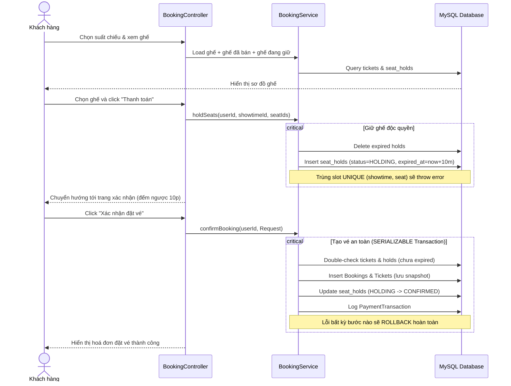

# Walkthrough: CORE-05 & CORE-06 — Quản lý Suất chiếu & Đặt vé, Giao dịch

## 1. Tổng quan
Chúng ta đã hoàn thành hai tính năng cốt lõi quan trọng nhất trong việc quản lý và vận hành rạp phim:
- **CORE-05 (Admin - Quản lý Suất chiếu)**: Cho phép Admin lập lịch chiếu cho phim tại các phòng, tự động tính toán thời gian kết thúc (phim + dọn phòng) và kiểm tra chống trùng lịch phòng chiếu.
- **CORE-06 (Customer - Đặt vé & Giao dịch)**: Cho phép Khách hàng chọn ghế từ sơ đồ phòng chiếu, giữ ghế tạm thời trong 10 phút chống double-booking, xác nhận thanh toán (bằng Tiền mặt/CASH hoặc Chuyển khoản) với cơ chế Rollback Transaction an toàn tuyệt đối.

Cả hai tính năng đã được kiểm thử biên dịch thành công qua Gradle Build (`BUILD SUCCESSFUL` trong 15s).

---

## 2. Kiến trúc & Nguyên lý hoạt động

### Cơ chế chống xung đột phòng chiếu (CORE-05)
Khi lập lịch cho suất chiếu:
$$\text{endTime} = \text{startTime} + \text{movieDuration} + \text{roomCleanupDuration}$$
Hệ thống sử dụng câu truy vấn JPA chống đè giờ:
```sql
SELECT s FROM Showtime s
WHERE s.room.id = :roomId
  AND s.status <> 'CANCELLED'
  AND s.startTime < :endTime
  AND s.endTime > :startTime
```
Nếu danh sách xung đột không rỗng, giao dịch tạo/sửa suất chiếu lập tức bị từ chối kèm thông báo lỗi chi tiết.

### Cơ chế đặt vé giữ ghế & Tránh Race Condition (CORE-06)
Quy trình đặt vé gồm 4 bước:



---

## 3. Files đã tạo & Sửa đổi

### CORE-05 — Quản lý Suất chiếu (15 files mới, 1 sửa)

#### Java Backend
- **Enums**: [ShowtimeStatus.java](file:///d:/Java%20Web%20Application/Session_16/Smart_Cinema_Booking_System/src/main/java/com/re/smart_cinema_booking_system/enums/ShowtimeStatus.java), [RoomType.java](file:///d:/Java%20Web%20Application/Session_16/Smart_Cinema_Booking_System/src/main/java/com/re/smart_cinema_booking_system/enums/RoomType.java)
- **Entities**: [Cinema.java](file:///d:/Java%20Web%20Application/Session_16/Smart_Cinema_Booking_System/src/main/java/com/re/smart_cinema_booking_system/entity/Cinema.java), [Room.java](file:///d:/Java%20Web%20Application/Session_16/Smart_Cinema_Booking_System/src/main/java/com/re/smart_cinema_booking_system/entity/Room.java), [Showtime.java](file:///d:/Java%20Web%20Application/Session_16/Smart_Cinema_Booking_System/src/main/java/com/re/smart_cinema_booking_system/entity/Showtime.java)
- **Repositories**: [CinemaRepository.java](file:///d:/Java%20Web%20Application/Session_16/Smart_Cinema_Booking_System/src/main/java/com/re/smart_cinema_booking_system/repository/CinemaRepository.java), [RoomRepository.java](file:///d:/Java%20Web%20Application/Session_16/Smart_Cinema_Booking_System/src/main/java/com/re/smart_cinema_booking_system/repository/RoomRepository.java), [ShowtimeRepository.java](file:///d:/Java%20Web%20Application/Session_16/Smart_Cinema_Booking_System/src/main/java/com/re/smart_cinema_booking_system/repository/ShowtimeRepository.java)
- **DTO**: [ShowtimeRequest.java](file:///d:/Java%20Web%20Application/Session_16/Smart_Cinema_Booking_System/src/main/java/com/re/smart_cinema_booking_system/dto/ShowtimeRequest.java)
- **Service**: [ShowtimeService.java](file:///d:/Java%20Web%20Application/Session_16/Smart_Cinema_Booking_System/src/main/java/com/re/smart_cinema_booking_system/service/ShowtimeService.java)
- **Controller**: [AdminShowtimeController.java](file:///d:/Java%20Web%20Application/Session_16/Smart_Cinema_Booking_System/src/main/java/com/re/smart_cinema_booking_system/controller/AdminShowtimeController.java)

#### Frontend (Admin)
- `list.html`: Danh sách suất chiếu kèm thẻ trạng thái (badge).
- `create.html` & `edit.html`: Form tạo và sửa suất chiếu, tự động giải thích cơ chế `end_time`.
- `detail.html`: Xem chi tiết suất chiếu và thời gian dọn phòng.

---

### CORE-06 — Đặt vé & Giao dịch (23 files mới, 2 sửa)

#### Java Backend
- **Enums**: 
  - [SeatHoldStatus.java](file:///d:/Java%20Web%20Application/Session_16/Smart_Cinema_Booking_System/src/main/java/com/re/smart_cinema_booking_system/enums/SeatHoldStatus.java) (HOLDING, EXPIRED, CONFIRMED, CANCELLED)
  - [BookingStatus.java](file:///d:/Java%20Web%20Application/Session_16/Smart_Cinema_Booking_System/src/main/java/com/re/smart_cinema_booking_system/enums/BookingStatus.java) (PENDING_PAYMENT, CONFIRMED, CANCELLED, EXPIRED, REFUNDED)
  - [PaymentStatus.java](file:///d:/Java%20Web%20Application/Session_16/Smart_Cinema_Booking_System/src/main/java/com/re/smart_cinema_booking_system/enums/PaymentStatus.java) (PENDING, SUCCESS, FAILED, REFUNDED)
  - [PaymentMethod.java](file:///d:/Java%20Web%20Application/Session_16/Smart_Cinema_Booking_System/src/main/java/com/re/smart_cinema_booking_system/enums/PaymentMethod.java) (VNPAY, MOMO, ZALOPAY, CASH, BANKING)
  - [TicketStatus.java](file:///d:/Java%20Web%20Application/Session_16/Smart_Cinema_Booking_System/src/main/java/com/re/smart_cinema_booking_system/enums/TicketStatus.java) (BOOKED, USED, CANCELLED, REFUNDED)
- **Entities**:
  - [SeatType.java](file:///d:/Java%20Web%20Application/Session_16/Smart_Cinema_Booking_System/src/main/java/com/re/smart_cinema_booking_system/entity/SeatType.java)
  - [Seat.java](file:///d:/Java%20Web%20Application/Session_16/Smart_Cinema_Booking_System/src/main/java/com/re/smart_cinema_booking_system/entity/Seat.java)
  - [SeatHold.java](file:///d:/Java%20Web%20Application/Session_16/Smart_Cinema_Booking_System/src/main/java/com/re/smart_cinema_booking_system/entity/SeatHold.java) ( UNIQUE `showtime_id`, `seat_id`)
  - [Booking.java](file:///d:/Java%20Web%20Application/Session_16/Smart_Cinema_Booking_System/src/main/java/com/re/smart_cinema_booking_system/entity/Booking.java)
  - [Ticket.java](file:///d:/Java%20Web%20Application/Session_16/Smart_Cinema_Booking_System/src/main/java/com/re/smart_cinema_booking_system/entity/Ticket.java) (lưu snapshot thông tin khi đặt vé cứng)
  - [PaymentTransaction.java](file:///d:/Java%20Web%20Application/Session_16/Smart_Cinema_Booking_System/src/main/java/com/re/smart_cinema_booking_system/entity/PaymentTransaction.java)
- **Repositories**:
  - [SeatTypeRepository.java](file:///d:/Java%20Web%20Application/Session_16/Smart_Cinema_Booking_System/src/main/java/com/re/smart_cinema_booking_system/repository/SeatTypeRepository.java)
  - [SeatRepository.java](file:///d:/Java%20Web%20Application/Session_16/Smart_Cinema_Booking_System/src/main/java/com/re/smart_cinema_booking_system/repository/SeatRepository.java)
  - [SeatHoldRepository.java](file:///d:/Java%20Web%20Application/Session_16/Smart_Cinema_Booking_System/src/main/java/com/re/smart_cinema_booking_system/repository/SeatHoldRepository.java)
  - [BookingRepository.java](file:///d:/Java%20Web%20Application/Session_16/Smart_Cinema_Booking_System/src/main/java/com/re/smart_cinema_booking_system/repository/BookingRepository.java)
  - [TicketRepository.java](file:///d:/Java%20Web%20Application/Session_16/Smart_Cinema_Booking_System/src/main/java/com/re/smart_cinema_booking_system/repository/TicketRepository.java)
  - [PaymentTransactionRepository.java](file:///d:/Java%20Web%20Application/Session_16/Smart_Cinema_Booking_System/src/main/java/com/re/smart_cinema_booking_system/repository/PaymentTransactionRepository.java)
- **DTOs**:
  - [SeatSelectionRequest.java](file:///d:/Java%20Web%20Application/Session_16/Smart_Cinema_Booking_System/src/main/java/com/re/smart_cinema_booking_system/dto/SeatSelectionRequest.java)
  - [BookingConfirmRequest.java](file:///d:/Java%20Web%20Application/Session_16/Smart_Cinema_Booking_System/src/main/java/com/re/smart_cinema_booking_system/dto/BookingConfirmRequest.java)
- **Service & Controller**:
  - [BookingService.java](file:///d:/Java%20Web%20Application/Session_16/Smart_Cinema_Booking_System/src/main/java/com/re/smart_cinema_booking_system/service/BookingService.java)
  - [BookingController.java](file:///d:/Java%20Web%20Application/Session_16/Smart_Cinema_Booking_System/src/main/java/com/re/smart_cinema_booking_system/controller/BookingController.java)

#### Frontend (Customer - Booking flow)
- `select-showtime.html`: Danh sách suất chiếu đang mở bán (`BOOKING_OPEN`) với giá cơ bản.
- `select-seats.html`: **Sơ đồ phòng chiếu (Seat Map)** hiển thị grid ghế có mã màu trực quan: trống, VIP, đôi, đang chọn, đang giữ bởi người khác, đã bán.
- `confirm.html`: Xác nhận đặt vé, tóm tắt ghế đã chọn, tính tổng giá (giá gốc × hệ số loại ghế), chọn phương thức thanh toán và countdown giữ ghế (10 phút).
- `result.html`: Giao diện hóa đơn đặt vé thành công kèm mã Booking (`BK...`), mã QR-like text để nhận vé tại quầy.

#### Sửa đổi Navbar
- [common.html](file:///d:/Java%20Web%20Application/Session_16/Smart_Cinema_Booking_System/src/main/resources/templates/fragments/common.html): Thêm liên kết **"Đặt vé"** cho role `CUSTOMER` (dòng 17) và **"Suất chiếu"** cho `ADMIN` (dòng 16).

---

## 4. Kịch bản Kiểm thử & Xác thực

### Kịch bản 1: Tạo suất chiếu trùng giờ (Admin)
1. Đăng nhập tư cách ADMIN (`admin@cinema.vn` / `123456`).
2. Vào **Suất chiếu** -> **Tạo suất chiếu mới**.
3. Tạo một suất chiếu cho phòng 1 vào cùng khoảng giờ với một suất chiếu đã tồn tại.
4. Lịch sẽ bị từ chối kèm cảnh báo: *Phòng "Phòng 1" đã có suất chiếu "..." từ ... đến ... Vui lòng chọn thời gian khác.*

### Kịch bản 2: Đặt vé & Giữ ghế (Customer)
1. Đăng nhập tư cách CUSTOMER (`nguyenvana@gmail.com` / `123456`).
2. Vào mục **Đặt vé** -> Chọn phim & suất chiếu mở bán.
3. Chọn ghế A3, A4 (Ghế thường) và tiến hành.
4. Kiểm tra trong DB bảng `seat_holds` sẽ thấy hai bản ghi có trạng thái `HOLDING` và `expired_at` là 10 phút sau.
5. Ở màn hình xác nhận, kiểm tra thời gian đếm ngược đếm lùi đều đặn.

### Kịch bản 3: Chống double-booking đồng thời (Race Condition)
1. Hai tab trình duyệt riêng biệt đăng nhập bằng tài khoản A và tài khoản B.
2. Cả hai cùng mở sơ đồ ghế của cùng một suất chiếu.
3. Cả hai cùng tích chọn ghế B2.
4. Người A nhấn chọn trước -> Giữ ghế thành công, chuyển tới trang xác nhận đơn hàng.
5. Người B nhấn chọn sau -> Nhận ngay thông báo: *Ghế B2 đang được giữ bởi người khác.*

### Kịch bản 4: Giữ ghế hết hạn (Timeout)
1. Chọn ghế và ở lại màn hình xác nhận cho tới khi bộ đếm giờ (10 phút) trở về `00:00`.
2. Trình duyệt tự động hiển thị alert thông báo hết giờ và điều hướng người dùng quay trở lại trang chọn ghế. Ghế đó tự động hiển thị là trống đối với các người dùng khác.
